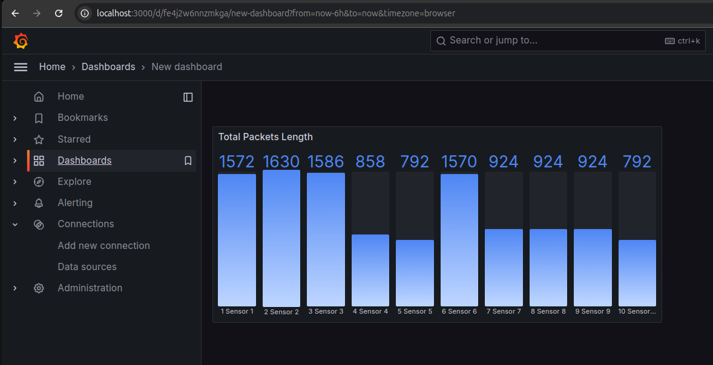
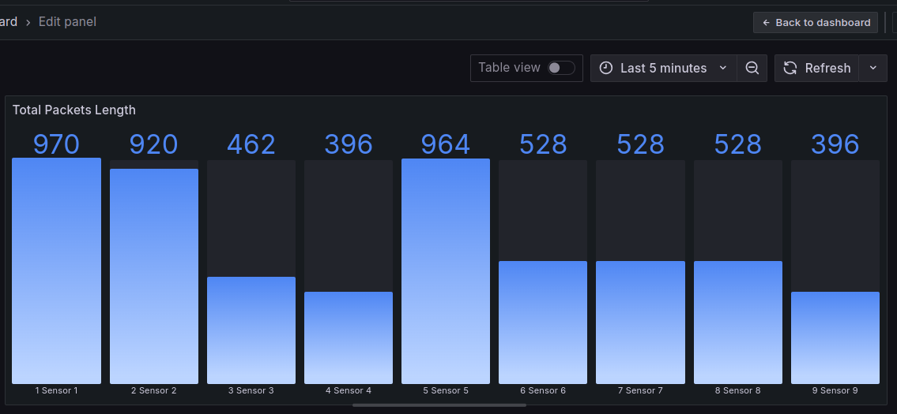
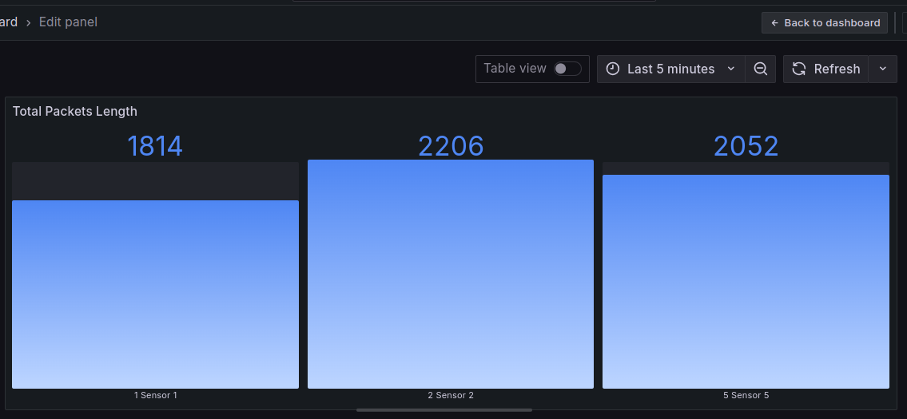
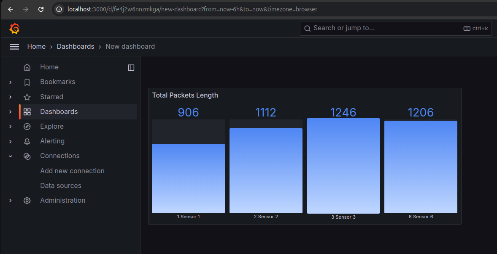

## P4EdgeNet Use Cases

### Requirements

* Ubuntu 18.04, 20.04 and 22.04
* Python 3 (default of these versions of ubuntu)
* Docker (will be installed together with containernet)
* Git
* This tutorial was performed into machine with 4 vCPUs and 8GB vRAM 

### Initial steps

* optional:
    * virtualbox 7.0

* This is important:
    * have sudo permission

* Install Git
    * `sudo apt-get update && sudo apt-get install git -y`

* Choose your work directory
    * These tutorial, we choose `/home/$USER`

* Install Containernet
    1. `git clone https://github.com/ramonfontes/containernet.git`
    2. `cd containernet`
    3. `sudo util/install.sh -W`

* Download repository p4-lowpan
    * `git clone https://github.com/ramonfontes/p4-lowpan.git`

* Enter into directory p4-lowpan
    * `cd /home/$USER/p4-lowpan`

### Use Case #1 - Non-Storage Mode Scenario (trickle time 5s)
 
Running the network topology:

## Step 1

`$ sudo python topology.py`

**On the first run, it will automatically download the p4 switch and grafana images**

**Don't worry about these mistakes**

**Will be open two display xterm with server flask and other grafana into host h1**

**Wait for the counter to finish 60 seconds in the terminal**

**After the counter finishes, open the browser and type localhost:3000 in the address bar to access a interface web of service Grafana**

## Step 2

**Type credentials with username `admin` and password `admin` and after, click `Log in`**

## Step 3

**Click `skip`**

## Step 4

**Click `New dashboard`**

## Step 5

**Click on the `three dots` and then on `View`**

### Results

## Step 6

**Now, you will see the result for Non-storage Mode Scenario with trickle time = 5s**

## Step 7

**Finally, click on the terminal again and type the command `EOF` and `Enter`**

**The command `EOF`, will terminate the containernet cli and its dependencies**

### **For the cases 2, 3 and 4 below, only repeat the steps before of case 1 above**

### Use Case #2 - Non-Storage Mode Scenario (trickle time 10s)
 
Running the network topology:  
`$ sudo python topology.py -10`

**follow the same steps as in use case 1**

### Results

**Here, you will see the result for Non-storage Mode Scenario with trickle time = 10s**

### Use Case #3 - Storage Mode Scenario (trickle time 5s)
 
Running the network topology:  
`$ sudo python topology.py -s`

**follow the same steps as in use case 1**

### Results

**Here, you will see the result for Storage Mode Scenario with trickle time = 5s**

### Use Case #4 - Storage Mode Scenario (trickle time 10s)
 
Running the network topology:  
`$ sudo python topology.py -s -10`

**follow the same steps as in use case 1**

### Results

**Here, you will see the result for Storage Mode Scenario with trickle time = 10s**

