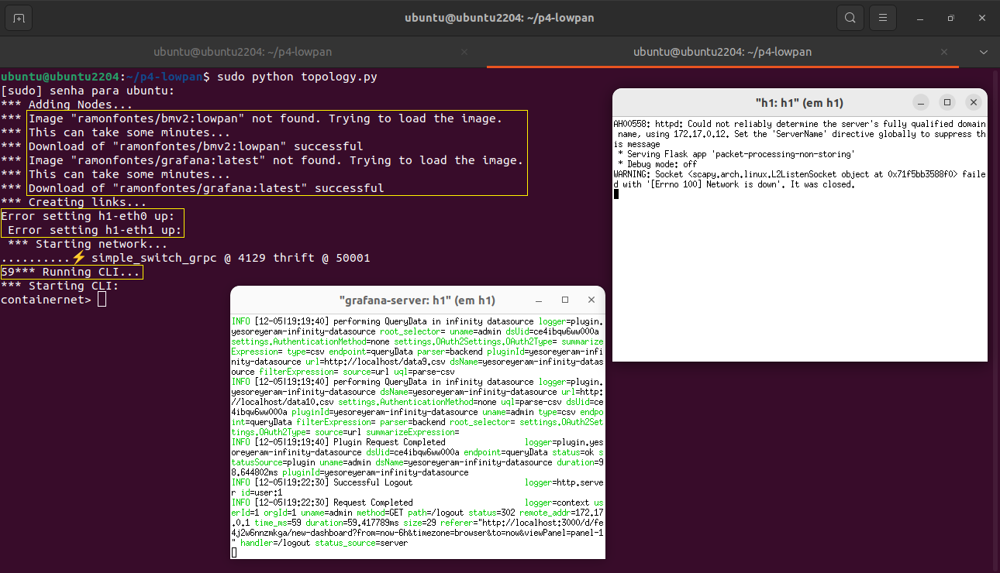
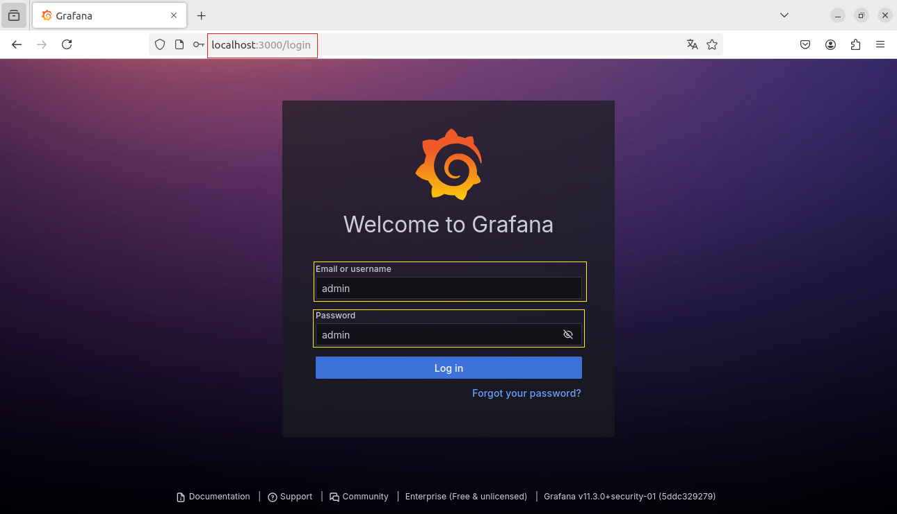
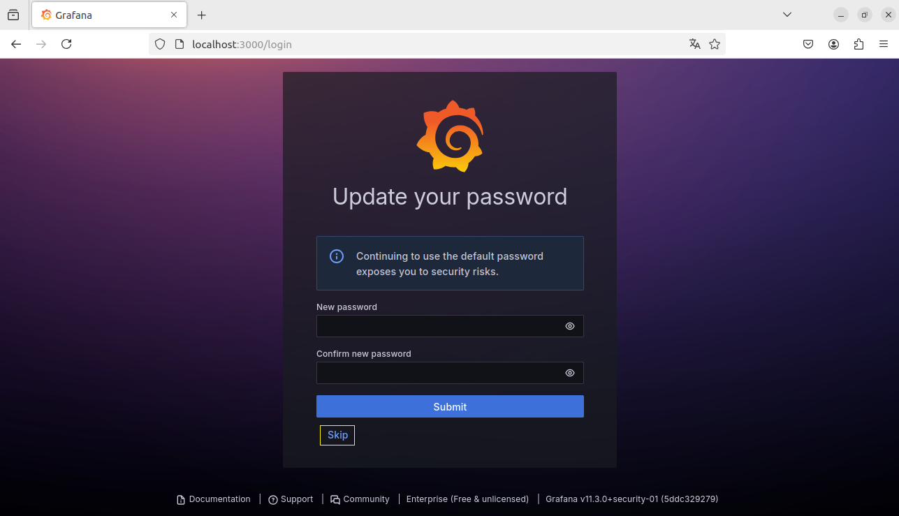
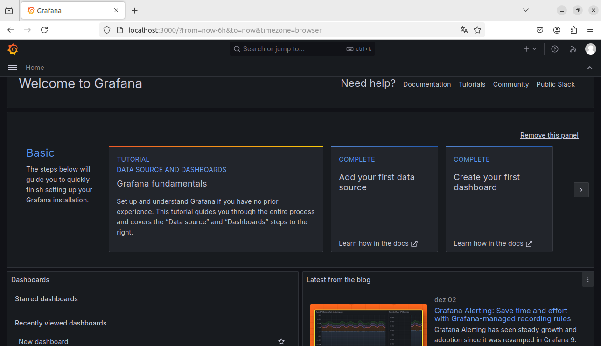
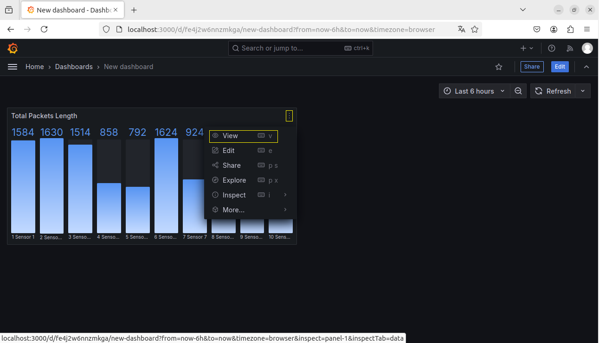
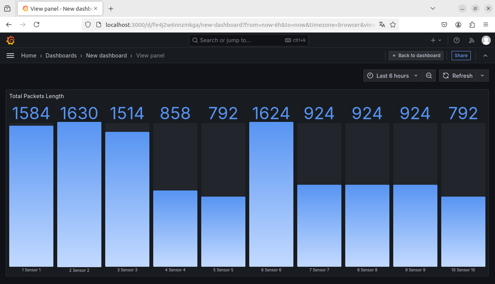
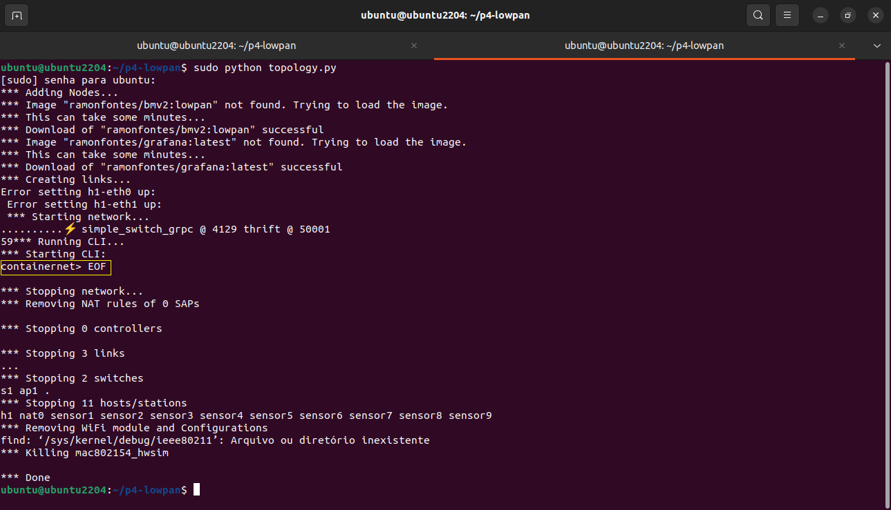
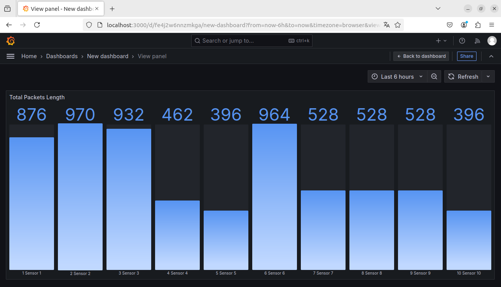
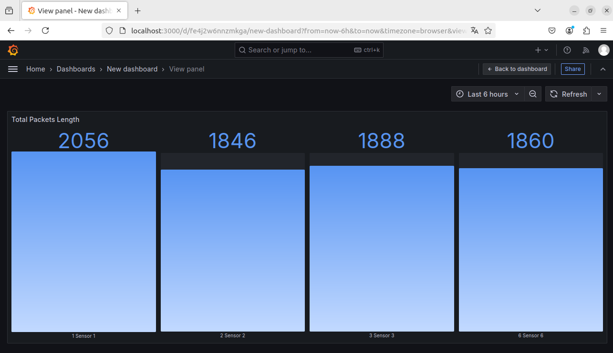
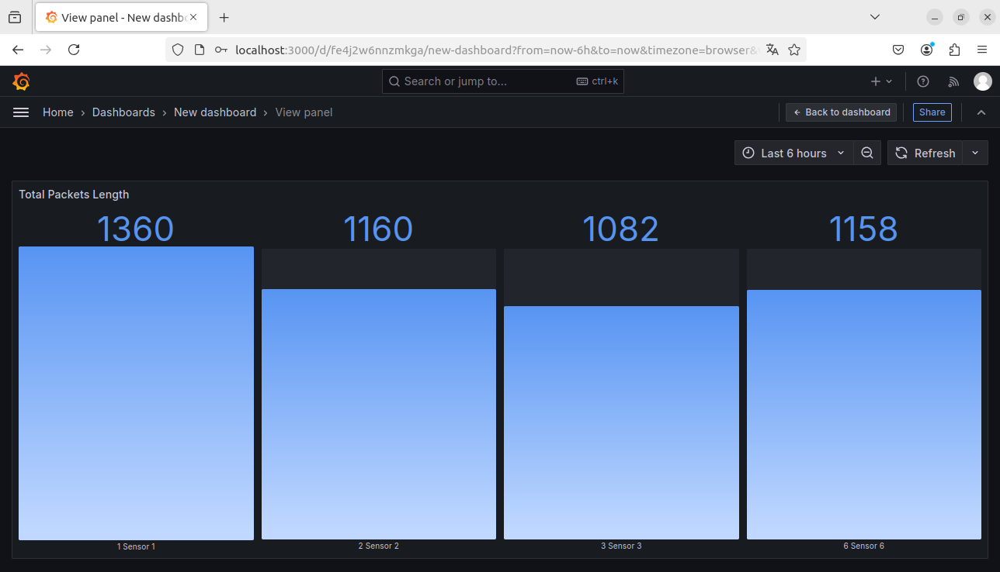

## P4EdgeNet Use Cases

### Requirements

* Ubuntu LTS +20.04 (22.04 - preferable)
* Containernet - https://github.com/ramonfontes/containernet

**Note**: This tutorial was performed in VM with 4 vCPUs and 8GB vRAM 

### Use Case #1 - Non-Storing Mode Scenario (trickle time 5s)
 
Running the network topology:

`$ sudo python topology.py`

* After running the script, two xterm windows will open: one for the Flask server and another for Grafana on host h1.
  * Wait for the terminal counter to complete its 60-second countdown...  
* Once the countdown finishes, open your browser and enter localhost:3000 in the address bar to access the Grafana web interface.

Type the credentials:

* Username: admin
* Password: admin

Then, click Log in to access the Grafana dashboard.

After logging in, click `Skip` to bypass the setup prompts.

Click `New Dashboard` to start creating a new dashboard.

Click on the `three dots` and then on `View`.

Then, you will see the result for Non-storing Mode Scenario with trickle time = 5s

Finally, go back to the terminal and type the command `EOF` or `exit` and `Enter`. 

## **For cases 2, 3, and 4, follow the same steps as in use case #1 after running `topology.py` accordingly:**

### Use Case #2 - Non-Storing Mode Scenario (trickle time 10s)
 
Running the network topology:  
`$ sudo python topology.py -10`

**> Follow the same steps as in use case 1**

### Results

Then, you will find below the results for Non-storing Mode Scenario with trickle time = 10s.

### Use Case #3 - Storing Mode Scenario (trickle time 5s)
 
Running the network topology:  
`$ sudo python topology.py -s`

**> Follow the same steps as in use case 1**

### Results

Then, you will find below the results for Storing Mode Scenario with trickle time = 5s.

### Use Case #4 - Storing Mode Scenario (trickle time 10s)
 
Running the network topology:  
`$ sudo python topology.py -s -10`

**> Follow the same steps as in use case 1**

### Results

Then, you will find below the results for Storing Mode Scenario with trickle time = 10s.

